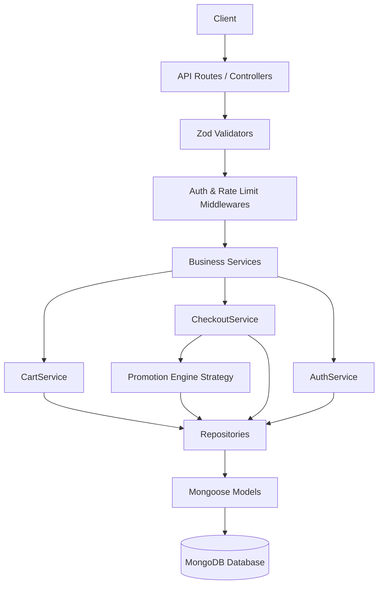
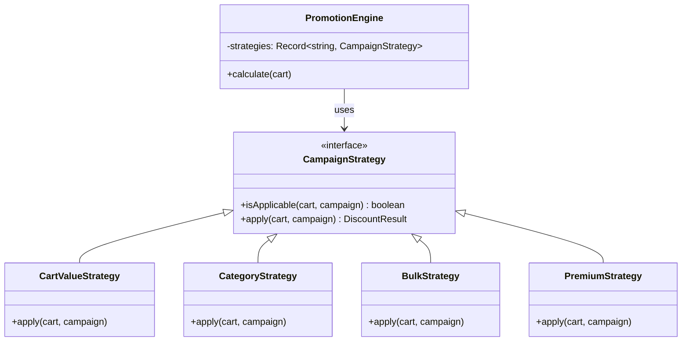

# CartFlow Architecture Design

## Architecture Overview
CartFlow follows a layered architecture to ensure a separation of concerns and to make the codebase maintainable and scalable.

## Promotion Engine Design (Strategy Pattern)
The promotion engine uses the Strategy design pattern to dynamically load and apply discount rules.

## Cart Expiration Strategy
Expired carts are handled via a hybrid approach:
1. **Cron Job Sweep**: A background job (`src/jobs/cartCleanup.ts`) runs every hour to sweep for carts whose `expiresAt` is in the past. It sets their status to `EXPIRED` and logs the action to `AuditLog`.
2. **TTL Indexes**: Mongoose can optionally handle native deletion if required, but for business audit trails, updating the status is preferred.

## Schema Decisions
- **Embedded vs Referenced**: CartItems are embedded inside the `Cart` document because they are bounded by the Cart's lifecycle and queried together. This prevents N+1 queries.
- **Audit Logging**: Handled via a decoupled repository that logs generic JSON payloads for events like add, remove, and checkout.

## Scaling Considerations
- **Stateless Auth**: JWT ensures no session state is maintained on the server, allowing horizontal scaling.
- **MongoDB Optimization**: `lean()` is used for read-only queries (like checking active campaigns or finding a user for login) to reduce memory overhead.
